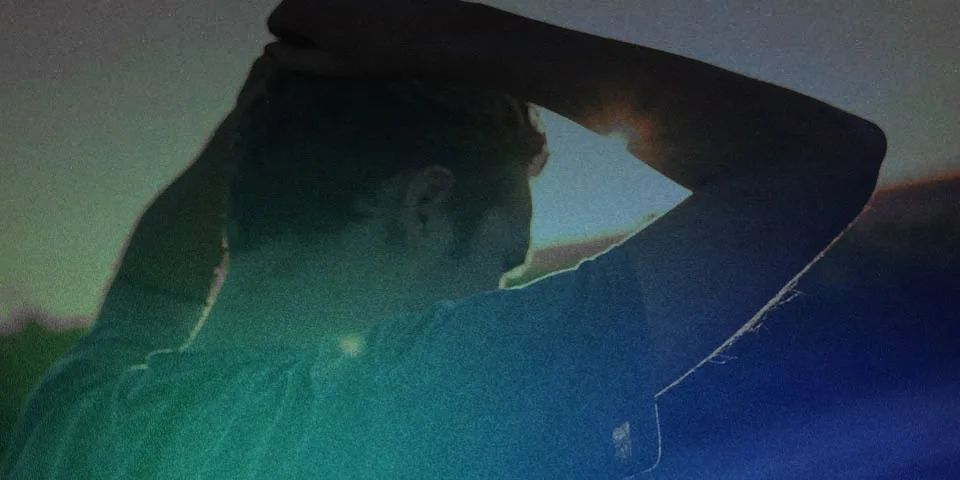

A veces la voz del síndrome del impostor es más fuerte que la voz de la motivación de nuestros sueños, y cuando logramos revertir los papeles de estas, la vida se torna sorprendéntemente mágica e inesperada, al punto del nacimiento de historias que de otra forma serian imposibles.

Para que me entiendas, primero te daré un poco más de contexto y te contaré como gracias a la necesidad y a el sentido de responsabilidad para conmigo, mi familia y nuestro futuro, decidí darle la mano al miedo así como a cualquier otro sentimiento o actitud negativa que tuviera en ese momento y empecé a caminar.

> _Es momento de recomendarte un buen café o la bebida que prefieras para que acompañes esta lectura._

### 2018

Me encontraba en un momento de mi vida extremadamete difícil a nivel económico y de salud por aquello del [accidente en moto](https://blog.maoacr.com/accidente/) del que te hablo en otro post, razón que nos había llevado en cuestión de poco más de 12 meses, progresivamente a perder casi todo lo que hasta este momento habiamos logrado construir con mi pareja.

Duele demasiado cuando vez que todo por lo que has trabajado casi toda tu vida, de repente se cae en un par de meses, se esfuma entre tus dedos sin darte la oportunidad de hacer demasiado para evitarlo.

Luego de decidir con mi pareja que era momento de irnos de la ciudad capital de nuestro pais ( Bogotá - Colombia ), e ir a buscar una vida más tranquila por nosotros y por nuestros hijos, gracias a mi suegra que quiero con mucha fuerza porque es una persona demasiado especial e importante en todas mis historias, quien nos tendio la mano abriendonos un espacio en su casa, terminamos en una ciudad mucho más pequeña de clima cálido con una actividad económica evidentemente más limitada que Bogotá intentado resurgir en contra de todos los pronósticos.

### 2019

No quiero aburrirte con todo lo que hemos tenido que sufrir y pasar como familia para lograr estar y ser quienes somos hoy día mucho más fuertes y unidos que nunca.

Con un dolor crónico desgastando mi mente segundo a segundo, pero con el afán y la necesidad de salir adelante por mi y mi familia, había escuchado de "Estudiar en linea" y el nombre de un par de plataformas como Platzi, Crehana y Coursera entre otras...

La parte para mi divertida e increible empieza con una idea que llego a mi cabeza de algun lugar del universo:

> _“Y si convezo a alguna empresa o marca de pagar mi suscripción a [Platzi](https://platzi.com) a cambio de realizar proyectos y trabajos relacionados con lo que vaya aprendiendo ?_ 🤔

Sin miedo ni pena empecé a buscar ese patrocinio y oh sorpresa que aparecio más pronto de lo que yo esperaba, en cuestion de días estaba registrandome por primera vez en la plataforma extremadamente feliz y motivado a estudiar y aprender todo lo que pudiera antes de que terminara mi suscripción.

La verdad es que yo nunca había estudiado de forma virtual y esto tampoco era tan común para entonces puesto que fue pre-pandemia.

A principio del año y de forma gratuita, realicé el Curso de Programación Básica dictado por el gran, irreverente, amado por unos y odiado por otros [Freddy Vega](https://freddyvega.com/), CEO & Co-Founder de [Platzi](https://platzi.com). Este curso y la forma en la que Freddy transmite su pasión por lo que hace, fue tal vez lo que, en medio de mi crisis, activó algo en mi cerebro que quizo ir a por convertirme en eso que estaba viendo frente a la computadora a toda costa.

Luego de la gran idea que cambiaría el rumbo de mi vida para siempre, y de un hermoso año lleno de conocimientos nuevos, motivaciones y metas nuevas, se acercaba el final de mi suscripción y mi situación económica no cambiaba.

Aún vivía en la casa de mi suegra con mi pareja y mis hijos, trabajando con cosas de diseño y publicidad que apenas nos permitian sobrevivir.

### 2020

Cuando creí que esa etapa había terminado, un correo electrónico me lleno el corazón de alegría nuevamente asi no entendiera muy bien a lo que me estaban invitando desde Platzi. Un Bootcamp de Desarrollo Web ( terminos que para entonces jamás había escuchado ) y que gracias a mi desempeño dentro de la plataforma durante el año de suscripción, me había ganado la oportunidad de pertenecer a este program piloto de esta gran plataforma.

> _“Platzi Master es un **programa exclusivo para nuestros mejores estudiantes** y por eso estamos encantados de informarte que el Comité de Admisiones ha decidido invitarte a que inicies este proceso con nosotros. Es un logro muy importante y estamos seguros que juntos llevaremos tu carrera a otro nivel.”_

Despues de comentarlo con algunas personas que muy incredulamente me decian cosas como: **"Platzi no sirve"**, "Yo nunca lo había escuchado" y "pero virtual será que uno si aprende?", llegó la pregunta de mi esposa que mirandome a los ojos me dijo: **Tú lo quieres hacer?**

 

Pues aqui estaba yo, en una dinámica que no terminaba de comprender muy bien al principio, rodeado de gente con las mismas o más ganas de aprender y de comerse el mundo que yo, junto con expertos en las diferentes áreas del Desarrollo de software como mentores tales como:

- [Stephania Aguilar](http://teffcode.co/)
- [Guillermo Rodas](https://guillermorodas.com/)
- [Oscar Barajas](https://gndx.dev)
- [Nicolas Molina](https://github.com/nicobytes)

 

### 2021

Luego de varias etapas, proyectos individuales y grupales, mucho trabajo duro y horas de código, entrevistas, pruebas técnicas, ahi estaba yo, un 10 de Marzo abriendo mis ojos y preparandome para lo que sería mi primer dia como Desarrollador Web UI Semi Senior de la empresa mas grande de tecnologia a nivel LATAM, Globant.

De repente después de 2 años que parecieron tal vez un par de meses de lo divertido y enfocado que me encontraba, había logrado cosas que nunca me hubiera tan si quiera imaginado que yo era capaz de hacer y mucho menos con un dolor crónico que me atormenta 24hrs al día sin descanso pero que mientras estoy escribiendo código, parece que desapareciera casi por completo de mi cuerpo

### Que historia tan larga !

Lo sé, traté de contarte lo más puntual e importante de cada etapa de este proceso asi que puedes imaginarte todos los problemas y obstaculos que pude haber tenido durante este camino…

### Conclusión

No es solo porque cambio mi vida, tampoco me estan pagando algun tipo de patrocinio o publicidad pero [Platzi](https://platzi.com) es una gran plataforma para estudiar, cuando los conoces te das cuenta del gran esfuerzo y trabajo de equipo que hay detras para mejorar dia a dia y ofrecerte la mejor experiencia y recursos posibles en su material para ti como estudiante.

Lo mas increible y poderoso es en definitiva su comunidad, aquí encuetras personas dispuestas a aprender tanto como a enseñar. Es increible y utópico el tipo de personas que encuentras aquí, siempre motivando a los demás, invitando a no perecer en el camino de la misma forma que buscan ser motivados por otros.

Tal vez suena a cliché pero al final, no es la plataforma quien te hace crecer; Tú eres el único responsable de lo que pase con tú vida y [Platzi](https://platzi.com) es una gran herramienta para potenciarte como persona y como profesional sin importar si vas a trabajar en la industria tech o si quieres ser un artista independiente o lo que sea.

> Voy a parar con esta historia aquí. Se podria contar de mil maneras y seguramente me salté muchos datos importantes que tratare de tocar en próximos posts. Solo espero que esta lectura te sirva para motivarte y te des cuenta que por más malo que parezca tu situación el día de hoy, Nunca pierdas la esperanza del nuevo día, y que si te esfuerzas, el final sin importar cual sea, siempre valdrá la pena.
